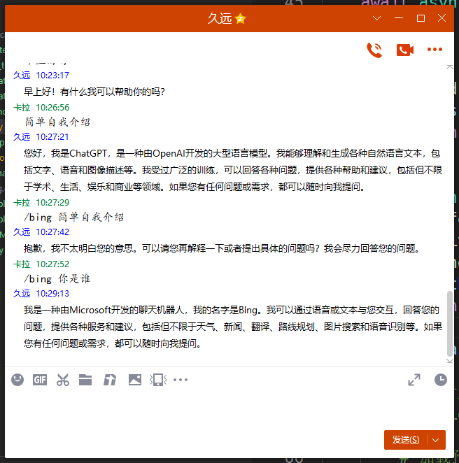

# KUON
久远，一个简单的聊天机器人，目前使用mirai对接了QQ，支持bing和chatgpt。

## 使用
### 环境

```
pip install -r requirements.txt
```

### 生成默认配置文件
```
python utilty/createExampleCfg.py
```
文件被生成在/config文件中，你需要在botconfig.json中填写mirai的配置，关于mirai服务搭建，可以在[博文](https://blog.kala.love/posts/c367c10b/)中查看
openAiConfig.json文件当然就是让你填写chatgpt的配置了，写入你的账号密码即可，目前使用的是[acheong08]
(https://github.com/acheong08?tab=repositories)的方案

### 下载对接chatgpt的代码（可选）
目前使用的acheong08/ChatGPT的方案，但是由于日新月异，可能需要经常需要更新，如果源码的接口变动了，那估计你的去改改MultiplethinkingA.py，目前openai官方是没有提供chatgpt的接口的，等之后有了更好的方案再说吧。
```
python utilty/updateChatGPT.py
```

### 下载bingChat（可选）
```
python utilty/updateBingChat.py
```
如果要使用bing机器人则需要有个得到测试资格的账号，在bing.com页面去导出cookie，然后保存到bingCookies.json里

### 运行
```
python QQbot.py
```
然后QQ好友直接对话，如果是群则@后对话。

### 效果



## 文件说明

* qqbot.py: 主程序，包含QQ消息的接收，调用chatgpt和bingChat获取应答，然后发送给QQ
* brain.py: 脑袋，用于管理各个思想，也即不同的对话机器人
* MultiplethinkingA.py: chatgpt的思想，包含了chatgpt的接口
* MultiplethinkingB.py: bingChat的思想，包含了bingChat的接口