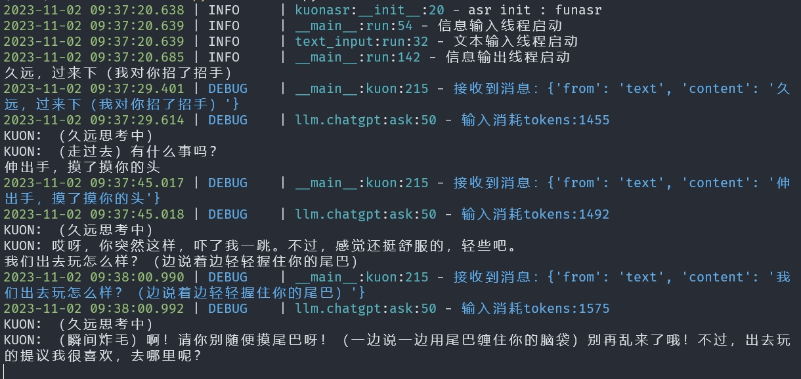
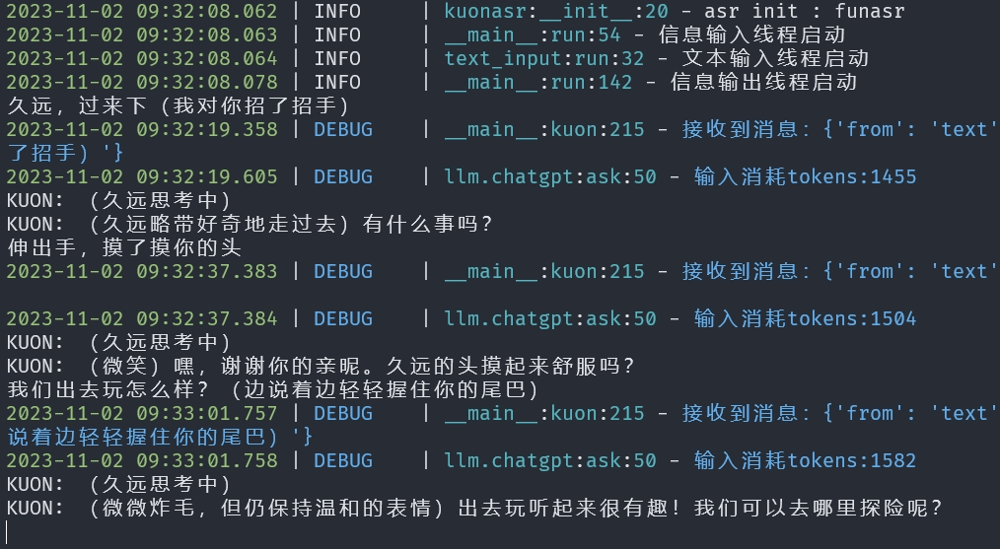
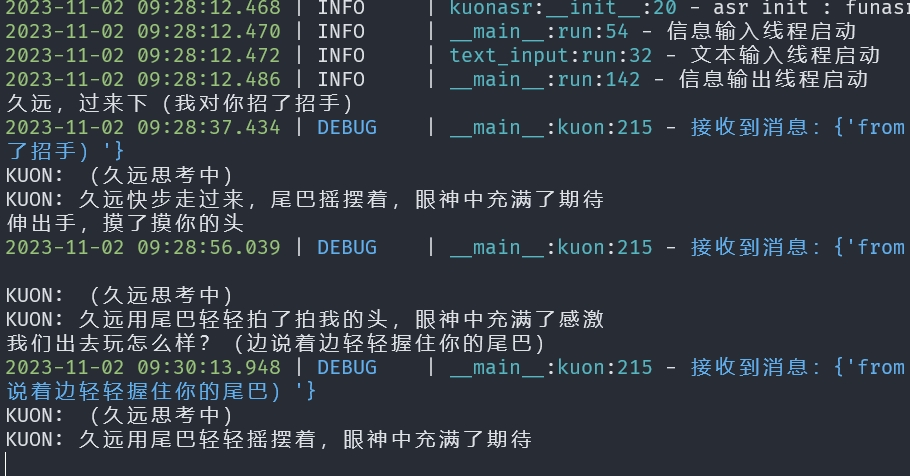

[首页](./README.md) | [旧版QQ-bot](https://github.com/lissettecarlr/kuon/tree/main) | [English](./README_en.md)
<p align="center">
 
<p align="center">
</p>

# KUON

久远，一个开发中的大模型语音助手。支持语言或文本输入，输出语音或文本。能够对接openai接口的对话模型。各个功能模块独立，可以自由组合。

## 1 开发简述

基于之前的分支又大刀阔斧的重构了一遍，主要将各个功能模块分离，使用接口的方式对接，而不是之前的融为一体，极大的提升了速度。也为了能之后在各个终端跑起来。

## 2 功能

- [x] 使用文本输入交流，输出文本和语音
- [x] 使用语音交流，输出文本和语音
- [x] 检查功能，用于测试各部分是否正常
- [ ] 使用动漫字幕作为提示词的久远人设（进行中）
- [x] 训练更好的vits模型
- [x] 文本命令
- [ ] 语音命令
- [ ] assistants模式

## 3 使用

### 3.1 环境

由于以将各个功能尽量剥离，所以配置也由原来的一个变成了多个，不过也就第一次改改，其实也还好。

#### 3.1.1 基础环境

* conda虚拟环境
    ```bash
    conda create -n kuon python=3.10
    conda activate kuon
    ```

* pytorch（如果均使用接口方式则无需下列环境）:
    ```bash
    #  CUDA 11.8
    pip install torch torchvision torchaudio --index-url https://download.pytorch.org/whl/cu118
    ```

* 安装基本软件包:
    ```bash
    pip install -r requirements.txt
    ```
    语言播放使用playsound，如果在windows上需要修改源码，在`Lib\site-packages\playsound.py`中移除utf-16进行解码的部分

* 或者直接用conda配置文件克隆（替代上面几步）
    导出：
    ```bash
    conda create --name kuon --file environment.yml
    ```
    导出
    ```bash
    conda env export > environment.yml
    ```

#### 3.1.2 语言转文本功能

现在被独立到仓库[AutomaticSpeechRecognition](https://github.com/lissettecarlr/AutomaticSpeechRecognition)。本仓库已经被添加相关代码到`kuonasr`文件夹，默认使用funasr接口方式，服务部署参考AutomaticSpeechRecognition仓库的[说明](https://github.com/lissettecarlr/AutomaticSpeechRecognition/blob/main/README.md)，需要使用其他方式自行参考该说明。

使用前请根据funasr服务位置修改配置文件`kuonasr/config.yaml`
```yaml
funasr:
   url: ws://172.0.0.1:1234
```

可以使用下列脚本拉去最新代码（通常不需要）
```bash
cd script
python asr_update.py
```

#### 3.1.3 文本转语言功能

现在被独立到仓库[TextToSpeech](https://github.com/lissettecarlr/TextToSpeech)，仓库分为训练模型的fineturn和推理的kuontts，本仓库已经将推理代码添加到`kuontts`文件夹

默认使用了接口方式，也即这里无需安装环境，也无需放入模型，需要根据部署的服务修改`kuontts/config.yaml`里的请求url和speaker。服务部署和其他问题请移步[TextToSpeech](https://github.com/lissettecarlr/TextToSpeech)仓库说明。

离线方式使用则修改配置文件`kuontts/config.yaml`，将`online`改为`offline`，并将模型放入`kuontts/offline/OUTPUT_MODEL`中，我这里暂时训练了paimon的模型来用。

如需要更新代码可以执行：
```bash
cd script
python tts_update.py
```


#### 3.1.4 对话模型

使用openai的api模式对接的模型服务，通过在llm中配置config.yaml指定对接对象。
```yaml
url : http://172.0.0.1:1234/v1/chat/completions
key : qmdr-xxxx
model : gpt-3.5-turbo-16k
timeout : 120 # 历史对话的遗忘时间
preset : ./llm/kuon.json 
```

其中`timeout`表示进过多次时间后情况历史对话。`preset`则是用于角色扮演的提示词地址。

目前其他开源模型也有openai的api部署方式，自己部署后修改这个配置文件即可。这边我试着用qwen-7b，但是角色扮演的效果很差，目前还是gpt-4最优解。

### 3.2 测试（可选）

使用前可以测试测试各个功能是否正常，分为：语音输入、语音转文本、对话模型、文本转语音、播放五个部分。每个测试都是独立的，可以选择跳过。

```bash
python check.py
```

### 3.3 运行

默认会打印所以日志，可以修改配置文件中的日志过滤器部分，例如只输出异常日志：
```yaml
log_filter : True
log_filter_level : WARNING
```

在根目录的配置文件修改一些默认选项
```yaml
# 是否开启语音输出
voice_output_sw : True

# 是否开启文本输出
text_output_sw : True

# 是否启动时开启语音输入
audio_input_sw : False
```

启动
```bash
python kuon.py
```

### 3.4 对话效果

该效果主要受到模型和提示词的影响，通过在llm/config.yaml中配置。需要注意的是目前gpt提示词我是通过动画字幕进行填写，量会很大，当使用付费api时会急速消耗token哦。看之后针对效果进行精简。

#### GPT4



#### gpt3.5



#### qwen-7b

非常容易重复回答，不太适应目前大量的提示词，该模型感觉在特化了知识问答方向后其他能力变弱了。




## 4 其他

####  4.1 无法输入声音

在配置文件中可以调整麦克风的输入通道，设备上由那些通道可以通过命令查看，默认是1
```
python .\utils\get_input_channels.py
输出
麦克风 ID 0 - Microsoft 声音映射器 - Input
麦克风 ID 1 - 麦克风 (WO Mic Device)
```
还能调节输入声音的阈值threshold，阈值越高，需要的声音越大才能触发输入。

#### 4.2 代码通过black格式化

[black仓库](https://github.com/psf/black)

#### 4.3 语音转文本相关问题

见仓库[AutomaticSpeechRecognition](https://github.com/lissettecarlr/AutomaticSpeechRecognition)，该仓库用于语音识别，目前有三种实现方式，分别是paraformer、whisper_online、funasr，能够独立使用

#### 4.4 文本转语音相关问题

见仓库[TextToSepeech](https://github.com/lissettecarlr/TextToSpeech),文本转语音，包含训练部分和推理部分，能本地运行也可服务器部署