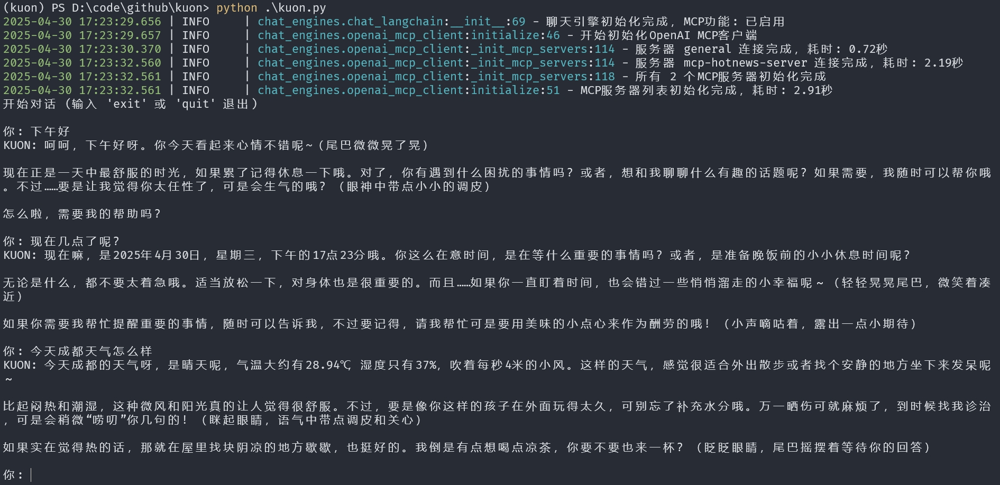

# Kuon

久远，一个开发中的大模型语音助手。之前代码太臃肿，于是新分支重写，重点放在易用性上，使其成为一个实用的东西。

## 开发简述

简约代码则不再使用本地模型，即使要本地化也使用接口方式对接本程序。大模型只对接`openai`接口，其他厂商模型可以使用`oneapi`的方式匹配。目前取消了语音输入，原因在于实在不常用。后续再考虑是否加入。使用`MCP`来扩展助手能力。

目前功能：
- [x] 大模型的记忆存储
- [x] 使用文本输入交流，输出文本和语音
- [x] MCP功能

后续计划：
- [ ] 优化TTS
- [ ] 优化记忆存储，提升记忆价值
- [ ] GUI交互

## 使用

### 环境

1. conda环境（可选）
```bash
conda create -n kuon python=3.10
conda activate kuon
```

2. 克隆仓库
```bash
git clone https://github.com/yourusername/kuon.git
cd kuon
```

3. 安装依赖
```bash
pip install -r requirements.txt
```

4. 配置API密钥

* 对话密钥（必须）
```bash
# windows -PowerShell
$env:OPENAI_API_KEY= ""
$env:OPENAI_BASE_URL= ""
# linux
export OPENAI_API_KEY=""
export OPENAI_BASE_URL=""
```

* TTS密钥（可选，目前只有阿里TTS，可以只文字交互）
```bash
# windows -PowerShell
$env:ALIYUN_ACCESS_KEY_ID= ""
# linux
export ALIYUN_ACCESS_KEY_ID=""
```


5. 配置文件，根目录的`config.yaml`
```yaml
tts:
  enabled: true  # 是否启用TTS
  engine: "aliyun"  # TTS引擎选择，目前支持 "aliyun" 

mcp:
  enabled: true  # 是否默认启用MCP工具
  config_path: "mcp_server/temp_mcp_server.json"  # MCP服务器配置文件路径 
```

如果要使用`mcp`，那还需要关注下对应的配置文件，这里提供的示例`mcp_server/temp_mcp_server.json`，示例具体格式如下：
```json
{
    "mcpServers": {
      "general": {
        "type": "stdio",
        "command": "执行命令",
        "args": ["命令参数"],
        "env": {
          "OPENWEATHERMAP_API_KEY": "额外环境变量"
        }
      },
      "mcp-hotnews-server": {
        "type": "sse",
        "url": "https://mcp.modelscope.cn/sse/"
      }
    }
  } 
```


### 启动

运行主程序:
```bash
python kuon.py
```

程序启动后，直接输入文本与AI交互。输入"exit"或"quit"退出程序。


效果:



### 其他

目前对话记忆被直接存储在了`chat_engines/memory.json`文件中，可以根据需求进行删改。
特别是存储了一些奇怪的东西时。
