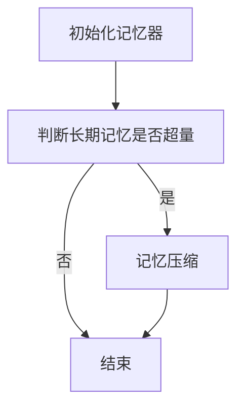
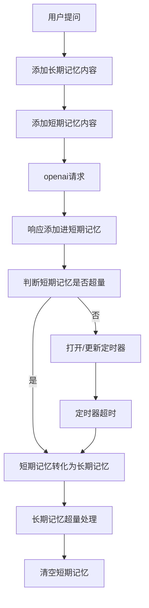

## 记忆AI对话系统设计

### 项目概述

记忆AI对话系统是一个基于OpenAI API实现的具有长短期记忆能力的智能对话助手。该系统可以记住与用户的对话内容，在保持上下文连贯性的同时，自动管理对话历史，避免超出模型的上下文限制。

### 核心特性

1. **双层记忆结构**：短期记忆存储最近对话，长期记忆存储经过压缩的重要信息
2. **自动记忆压缩**：定期将短期记忆压缩转化为长期记忆
3. **记忆持久化**：支持将长期记忆保存到文件系统，确保对话记忆不丢失
4. **上下文管理**：自动监控并控制对话上下文长度，避免超出模型限制
5. **模型灵活配置**：支持配置不同的对话模型和记忆处理模型

### 系统架构

#### 初始化流程



#### 对话流程



### 记忆管理机制

#### 短期记忆 (Short-term Memory)
- 存储完整的最近对话内容
- 直接使用原始对话内容，无压缩
- 当token数量超过设定阈值时触发压缩
- 使用定时器机制在空闲时间自动压缩

#### 长期记忆 (Long-term Memory)
- 存储经过压缩提炼的重要信息
- 通过AI模型将短期记忆压缩转化而来
- 保存为标准JSON格式，支持持久化到文件系统
- 自动限制条目数量，防止无限增长

#### 记忆压缩原理
1. 构建专门的压缩提示(Prompt)指导AI提取重要信息
2. 保持user和assistant角色交替出现的对话格式
3. 保留用户个人信息、偏好和重要事实
4. 去除无实质内容的客套话
5. 对长内容进行精简，只保留关键信息

### 技术实现

#### 关键参数配置
- `memory_model_name`: 用于记忆压缩的模型名称
- `chat_model_name`: 用于对话的模型名称
- `compress_interval`: 记忆压缩的时间间隔(秒)
- `context_length_multiplier`: 控制使用的上下文长度比例(0.1-1.0)
- `max_long_term_memories`: 长期记忆的最大条目数

#### Token管理
- 使用tiktoken库精确计算token数量
- 基于模型类型自动选择对应的上下文长度限制
- 通过context_length_multiplier参数控制实际使用的上下文长度

#### 记忆持久化
- 使用JSON格式存储长期记忆
- 启动时自动加载已有记忆
- 关闭时自动保存记忆内容


### 异常处理

系统实现了多层异常处理机制：
1. API调用失败的优雅降级
2. 记忆压缩失败时的回退策略
3. 记忆格式校验和修复
4. 文件I/O异常处理

### 未来扩展

1. 支持多用户记忆隔离
2. 记忆内容优化和存储方式的优化
3. 添加主动回忆和遗忘机制


### 测试代码
```python
from kuon_ai import MemoryChatAssistant
import os

if __name__ == "__main__":
    chat_assistant = MemoryChatAssistant(
        openai_api_key=os.getenv("OPENAI_API_KEY"),
        openai_base_url=os.getenv("OPENAI_BASE_URL"),
        compress_interval=60
    )
    # 流式接收回复
    for chunk in chat_assistant.chat("你好"):
        print(chunk, end="", flush=True)
    for chunk in chat_assistant.chat("我喜欢运动"):
        print(chunk, end="", flush=True)
    import time
    time.sleep(120)
    # 退出
    chat_assistant.exit()

```